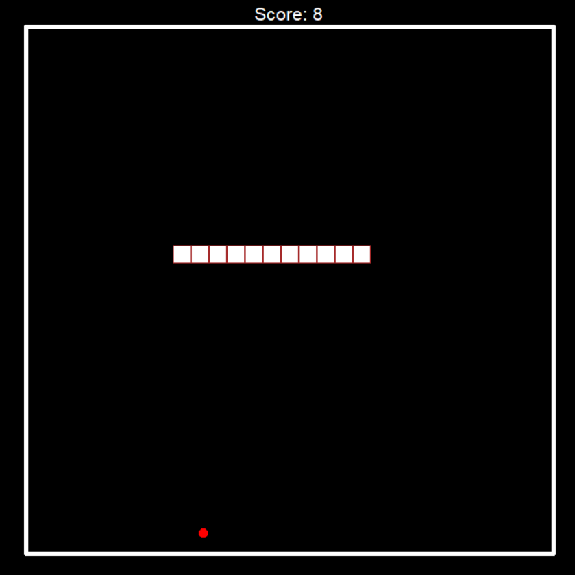
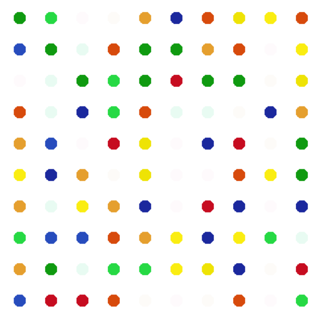
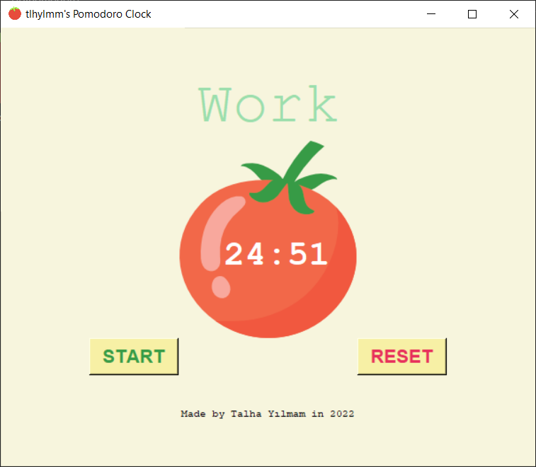

# python-playground
###### Personel projects created during Python learning.

##### GUI Snake - Yet another snake game

##### GUI Hirst Painting - A painting generator inspired from Damien Hirst's art, extracts colors from images using colorgram library.

##### GUI Pomodoro - A pomodoro clock timer to track work time.

##### OOP Coffee Machine - A coffee machine interface with object oriented principles applied
##### Quiz Game - Simple quiz game
##### Adam Asmaca - Basic hangman game with modifiable list inside.
##### Blackjack - Blackjack game with console interface
##### Caesar Cipher - Very basic implementaton of Caesar Ciphering
##### Coffee Machine - An all-in-one coffee machine interface
##### Etch-a-Sketch - Simple drawing app inspired from famous toy
##### FizzBuzz - Very simple code for practising modulo operations
##### Password Generator - Password generator that generates simple or complex passwords
##### Rock Paper Scissors - A rock paper scissor game with randomized computer response
##### Secret Auction - Simple bid collecting and winner picking tool
##### True Love - Implementation of popular true love calculation game
##### Turtle Spirograph - A basic app to draw spirographs.
